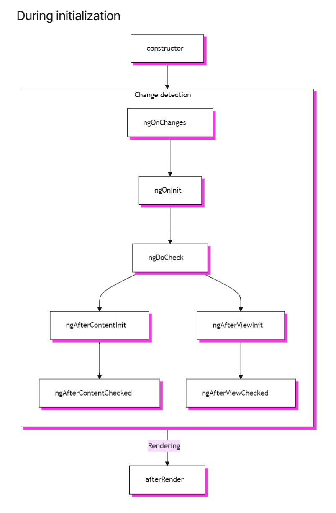
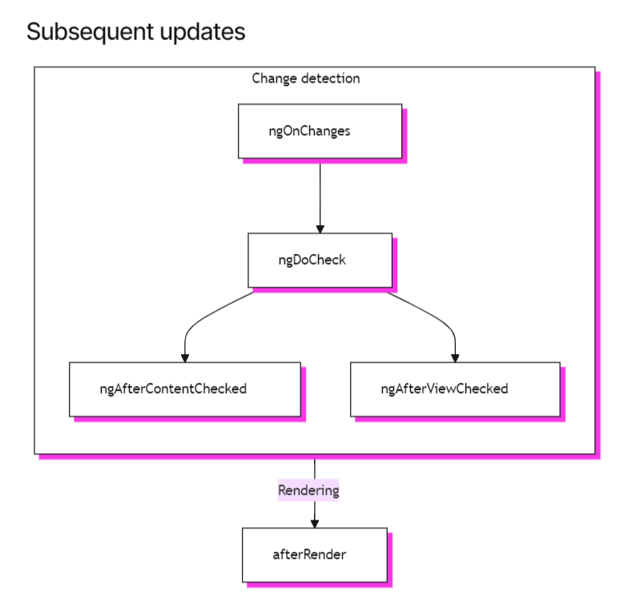

# Angular interview questions

## General

<details>
<summary>1. What is Angular and what is it used for?</summary>

[Angular](https://angular.dev/overview) is a web framework that empowers developers to build fast, reliable applications.
Maintained by a dedicated team at Google, Angular provides a broad suite of tools, APIs, and libraries to simplify and streamline your development workflow. Angular gives you a solid platform on which to build fast, reliable applications that scale with both the size of your team and the size of your codebase.

#### Key Features of Angular

- Component-Based Architecture:

Applications are built using reusable components, each encapsulating its own logic and view, which promotes modularity and maintainability.

- Two-Way Data Binding:

Synchronizes data between the model and the view, ensuring that changes in the model are automatically reflected in the view and vice versa.

- Dependency Injection:

Angular's dependency injection system helps manage the dependencies of components and services, making the code more modular, testable, and maintainable.

- Directives:

Extend HTML's capabilities by creating custom HTML tags and attributes, which can manipulate the DOM and add behavior to elements.

- Services:

Reusable business logic can be encapsulated in services, which can then be injected into components or other services, promoting code reuse and separation of concerns.

- Signals:

Angular provides a powerful signal system, which allows components to communicate with each other in a loosely coupled manner.

- Change Detection:

Angular provides a change detection mechanism, which allows components to detect changes in their data and update their view accordingly.

- Pipes:

Angular provides a powerful pipe system, which allows you to transform data within your application.

- Routing:

Angular's powerful router enables the creation of SPAs with multiple views, allowing for navigation between different parts of the application without a full page reload.

- Forms:

Angular provides robust support for handling user input through both template-driven and reactive forms, with built-in validation.

- HTTP Client:

Built-in services for making HTTP requests to interact with backend APIs, making it easier to handle asynchronous operations.

- Animation:

Angular includes a module for creating complex animations to enhance the user experience.

- Internationalization (i18n):

Built-in support for internationalizing applications, making it easier to translate the app into different languages.

- Testing:

Angular is designed with testing in mind, offering tools and best practices for unit testing (using Jasmine and Karma) and end-to-end testing (using Protractor).

#### Example Use Cases

- Single-Page Applications (SPAs):

Applications that load a single HTML page and dynamically update the content as the user interacts with the app, providing a smooth user experience.

- Enterprise Web Applications:

Large-scale applications that require maintainability, scalability, and robust architecture, such as CRM systems, content management systems, and e-commerce platforms.

- Progressive Web Apps (PWAs):

Web applications that provide a native app-like experience, including offline capabilities, push notifications, and faster load times.

```ts
import { Component } from '@angular/core';

@Component({
  selector: 'app-hello-world',
  template: `<h1>Hello, {{ name }}!</h1>`,
  styles: [
    `
      h1 {
        font-family: Lato;
      }
    `,
  ],
})
export class HelloWorldComponent {
  name = 'Angular';
}
```

</details>

<details>
<summary>2. What is Angular CLI and what are its main features?</summary>

[The Angular CLI](https://angular.dev/tools/cli) is a command-line interface tool which allows you to scaffold, develop, test, deploy, and maintain Angular applications directly from a command shell.
Angular CLI is published on npm as the @angular/cli package and includes a binary named ng. Commands invoking ng are using the Angular CLI.

#### Main Features of Angular CLI

- Project Initialization: `ng new`.
- Scaffolding: generate components, services, modules, and other Angular constructs using `ng generate` (or `ng g`) command.
- Development Server: local development server with live reloading using `ng serve`.
- Build Automation: `ng build`.
- Testing:
  - unit tests with Karma using `ng test`.
  - end-to-end tests with Protractor using `ng e2e`.
- Linting: `ng lint`.
- Code Updates: update your Angular application and its dependencies using `ng update`.
- Deployment: deploy your application to platforms like Firebase using third-party deployment tools.
- Configuration: manage different environments and configurations for your application (e.g., development, production).
- Internationalization: support for creating and managing localized versions of your application.

</details>

<details>
<summary>3. What is a module in Angular, and what is its role in an application?</summary>

In Angular, a module is a cohesive block of code dedicated to an application domain, a workflow, or a closely related set of capabilities. An Angular module is defined using the `@NgModule` decorator, which provides metadata that tells Angular how to compile and launch the application.

Angular code that predates standalone components uses [NgModule](https://angular.dev/guide/components/importing#ngmodules) as a mechanism for importing and using other components. See the full [NgModule guide](https://angular.dev/guide/ngmodules) for details.

#### Role of a Module in an Angular Application

- Organization:

Modules help organize an application into cohesive blocks of functionality, making the application easier to manage and scale.

- Separation of Concerns:

They promote separation of concerns by encapsulating related components, services, directives, and pipes, which enhances maintainability.

- Dependency Management:

Modules manage dependencies by specifying which components, directives, and pipes they use, and which services they require.

- Lazy Loading:

Angular modules support lazy loading, which can improve application performance by loading parts of the application only when they are needed.

- Scalability:

They enable the development of large applications by breaking down the application into smaller, more manageable pieces.

#### Key Properties of `@NgModule`

- declarations:

Specifies the components, directives, and pipes that belong to the module.

- imports:

Lists other modules whose exported components, directives, or pipes are needed by the components in this module.

- providers:

Specifies the services available to the module.

- bootstrap:

Lists the root component(s) that Angular should bootstrap when the application starts.

#### Core Module

The root module, often called AppModule, is the entry point of an Angular application:

```ts
import { NgModule } from '@angular/core';
import { BrowserModule } from '@angular/platform-browser';
import { AppComponent } from './app.component';
import { HelloWorldComponent } from './hello-world/hello-world.component';

@NgModule({
  declarations: [AppComponent, HelloWorldComponent],
  imports: [BrowserModule],
  providers: [],
  bootstrap: [AppComponent],
})
export class AppModule {}
```

#### Feature Modules

In addition to the root module, an Angular application can have multiple feature modules. A feature module is dedicated to a specific application feature or functionality. This helps in organizing the code better and enables lazy loading.

```ts
import { NgModule } from '@angular/core';
import { CommonModule } from '@angular/common';
import { FeatureComponent } from './feature/feature.component';

@NgModule({
  declarations: [FeatureComponent],
  imports: [CommonModule],
  exports: [FeatureComponent],
})
export class FeatureModule {}
```

#### Summary

Modules are (were!) fundamental building blocks in Angular applications. They help in organizing the application into cohesive blocks, managing dependencies, enabling lazy loading, and improving maintainability and scalability. By dividing an application into modules, developers can build and maintain large-scale applications more efficiently.

</details>

<details>
<summary>4. What is inter-component communication in Angular? Describe different ways of sharing data between components (e.g., @Input/@Output, services with Observables, etc.).</summary>

Inter-component communication in Angular refers to the methods and techniques used to share data and interact between different components within an application. Angular provides several ways to facilitate this communication:

#### 1. `@Input` and `@Output` Decorators

These decorators are used for parent-child communication, where a parent component passes data to a child component and vice versa.

`@Input`: Allows a parent component to pass data to a child component.

```ts
// Parent Component Template
<app-child [childInput]="parentData"></app-child>

// Child Component
import { Component, Input } from '@angular/core';

@Component({
  selector: 'app-child',
  template: `<p>{{ childInput }}</p>`
})
export class ChildComponent {
  @Input() childInput: string;
}
```

`@Output`: Allows a child component to send data to a parent component using an event.

```ts
// Child Component
import { Component, Output, EventEmitter } from '@angular/core';

@Component({
  selector: 'app-child',
  template: `<button (click)="sendData()">Send Data</button>`
})
export class ChildComponent {
  @Output() dataEmitter = new EventEmitter<string>();

  sendData() {
    this.dataEmitter.emit('Data from Child');
  }
}

// Parent Component Template
<app-child (dataEmitter)="receiveData($event)"></app-child>

// Parent Component
import { Component } from '@angular/core';

@Component({
  selector: 'app-parent',
  template: `<app-child (dataEmitter)="receiveData($event)"></app-child>`
})
export class ParentComponent {
  receiveData(data: string) {
    console.log(data);
  }
}
```

#### 2. Services with `Observables`

Services can be used as a central place to share data between components, especially when the components are not directly related.

Service: Create a service that uses an `Observable` to share data.

```ts
import { Injectable } from '@angular/core';
import { BehaviorSubject, Observable } from 'rxjs';

@Injectable({
  providedIn: 'root',
})
export class DataService {
  private dataSubject = new BehaviorSubject<string>('Initial Data');
  data$: Observable<string> = this.dataSubject.asObservable();

  updateData(newData: string) {
    this.dataSubject.next(newData);
  }
}
```

Components: Inject the service and subscribe to the `Observable`.

```ts
// Component A (Sender)
import { Component } from '@angular/core';
import { DataService } from './data.service';

@Component({
  selector: 'app-component-a',
  template: `<button (click)="updateData()">Update Data</button>`,
})
export class ComponentA {
  constructor(private dataService: DataService) {}

  updateData() {
    this.dataService.updateData('Updated Data from Component A');
  }
}

// Component B (Receiver)
import { Component, OnInit } from '@angular/core';
import { DataService } from './data.service';

@Component({
  selector: 'app-component-b',
  template: `<p>{{ data }}</p>`,
})
export class ComponentB implements OnInit {
  data: string;

  constructor(private dataService: DataService) {}

  ngOnInit() {
    this.dataService.data$.subscribe((data) => (this.data = data));
  }
}
```

#### 3. `ViewChild` and `ContentChild` Decorators

These decorators allow a parent component to access a child component's properties and methods directly.

`@ViewChild`: Used to access a child component declared in the parent component's template.

```ts
// Child Component
import { Component } from '@angular/core';

@Component({
  selector: 'app-child',
  template: `<p>Child Component</p>`,
})
export class ChildComponent {
  childMethod() {
    console.log('Child Method Called');
  }
}

// Parent Component
import { Component, ViewChild, AfterViewInit } from '@angular/core';

@Component({
  selector: 'app-parent',
  template: `<app-child></app-child>`,
})
export class ParentComponent implements AfterViewInit {
  @ViewChild(ChildComponent) childComponent: ChildComponent;

  ngAfterViewInit() {
    this.childComponent.childMethod();
  }
}
```

`@ContentChild`: Used to access a child component projected into the parent component using content projection.

```ts
// Child Component (Projected)
import { Component } from '@angular/core';

@Component({
  selector: 'app-projected-child',
  template: `<p>Projected Child Component</p>`,
})
export class ProjectedChildComponent {}

// Parent Component
import { Component, ContentChild, AfterContentInit } from '@angular/core';

@Component({
  selector: 'app-parent',
  template: `<ng-content></ng-content>`,
})
export class ParentComponent implements AfterContentInit {
  @ContentChild(ProjectedChildComponent) projectedChild: ProjectedChildComponent;

  ngAfterContentInit() {
    console.log(this.projectedChild);
  }
}
```

#### 4. RxJS `Subjects`

Subjects are a type of `Observable` that can multicast to multiple observers. They can be used for broadcasting data to multiple components.

```ts
import { Component } from '@angular/core';
import { Subject } from 'rxjs';

// Service
@Injectable({
  providedIn: 'root',
})
export class DataService {
  private dataSubject = new Subject<string>();
  data$ = this.dataSubject.asObservable();

  sendData(data: string) {
    this.dataSubject.next(data);
  }
}

// Component A (Sender)
@Component({
  selector: 'app-component-a',
  template: `<button (click)="sendData()">Send Data</button>`,
})
export class ComponentA {
  constructor(private dataService: DataService) {}

  sendData() {
    this.dataService.sendData('Data from Component A');
  }
}

// Component B (Receiver)
@Component({
  selector: 'app-component-b',
  template: `<p>{{ data }}</p>`,
})
export class ComponentB implements OnInit {
  data: string;

  constructor(private dataService: DataService) {}

  ngOnInit() {
    this.dataService.data$.subscribe((data) => (this.data = data));
  }
}
```

#### 5. `Signals`

Signals in Angular can be used to create reactive state objects that emit new values when the state changes. This can be very useful for sharing data between components.

Create a `Signal`: First, create a Signal that will be shared across components. This is typically done in a service.

```ts
import { Injectable, Signal } from '@angular/core';

@Injectable({
  providedIn: 'root',
})
export class SignalService {
  private signal = new Signal<string>('Initial Data');

  get dataSignal() {
    return this.signal;
  }

  updateData(newData: string) {
    this.signal.emit(newData);
  }
}
```

Use the `Signal` in Components: Inject the service in your components and subscribe to the signal to get updates.

_Component A (Sender):_

```ts
import { Component } from '@angular/core';
import { SignalService } from './signal.service';

@Component({
  selector: 'app-component-a',
  template: `<button (click)="updateData()">Update Data</button>`,
})
export class ComponentA {
  constructor(private signalService: SignalService) {}

  updateData() {
    this.signalService.updateData('Updated Data from Component A');
  }
}
```

_Component B (Receiver):_

```ts
import { Component, OnInit } from '@angular/core';
import { SignalService } from './signal.service';

@Component({
  selector: 'app-component-b',
  template: `<p>{{ data }}</p>`,
})
export class ComponentB implements OnInit {
  data: string;

  constructor(private signalService: SignalService) {}

  ngOnInit() {
    this.signalService.dataSignal.subscribe((data) => (this.data = data));
  }
}
```

</details>

## Components

<details>
<summary>1. What are Components in Angular, and how are they the foundation of an application structure?</summary>

[Components](https://angular.dev/essentials/components) in Angular are the fundamental building blocks of an Angular application. Each component encapsulates a portion of the user interface (UI) and its associated logic, making the application modular and easier to manage.

Components provide structure for organizing your project into easy-to-understand parts with clear responsibilities so that your code is maintainable and scalable.

#### How Components Form the Foundation of an Angular Application

- Modularity:

Components break down the application into smaller, manageable, and reusable pieces, making the codebase easier to understand and maintain.

- Reusability:

Once created, a component can be reused across various parts of the application or even in different applications.

- Separation of Concerns:

Components maintain a clear separation between the UI and the logic, promoting cleaner and more organized code.

- Encapsulation:

Each component encapsulates its logic, template, and styles, ensuring that changes in one component do not affect others.

- Composability:

Components can be nested within other components, allowing complex UIs to be composed from simpler building blocks.

</details>

<details>
<summary>2. How do you configure a component's selector, template, and style using the @Component decorator?</summary>

#### Defining a Component

Every component has the following core and some of the recommended or necessary properties:

- Decorator!:

A [@Component decorator](https://www.typescriptlang.org/docs/handbook/decorators.html) that contains some configuration and provides metadata about the component.

- Selector!:

A [CSS selector](https://developer.mozilla.org/ru/docs/Learn/CSS/Building_blocks/Selectors) that defines how the component is used in HTML. It is used to insert the component's template into the parent template.

- Template!:

  - The HTML part of the component, defining what the component should render.
  - Can be defined inline using the template property or in an external HTML file using the `templateUrl` property.

- Class!:

A TypeScript class where you define the logic and data for the component. It contains properties and methods that can be used in the component's template.

- Styles?:

  - A string or array of strings that contains any CSS styles you want applied to the component.
  - Can be defined inline using the styles property or in an external stylesheet using the `styleUrl` property.

- Standalone?: true

The recommended approach of streamlining the authoring experience of components.

- ChangeDetection?: ChangeDetectionStrategy.OnPush

The recommended approach of determining when the component should be re-rendered.

- Imports?: []

The necessary imports for the component.

- Providers?: []

The necessary providers for the component.

```ts
import { Component } from '@angular/core';

@Component({
  selector: 'app-example', // The selector used in HTML to include this component
  templateUrl: './example.component.html', // Path to the component's template
  styleUrls: ['./example.component.css'], // Path to the component's styles
})
export class ExampleComponent {
  title: string = 'Hello, Angular';

  // Method to change title
  changeTitle(newTitle: string) {
    this.title = newTitle;
  }
}
```

```html
<div>
  <h1>{{ title }}</h1>
  <button (click)="changeTitle('Title Changed')">Change Title</button>
</div>
```

```css
h1 {
  color: blue;
}
button {
  margin-top: 10px;
}
```

</details>

<details>
<summary>3. How would you explain the component lifecycle and its main methods (e.g., ngOnInit, ngOnChanges, ngOnDestroy)?</summary>

Angular components have a [lifecycle](https://angular.dev/guide/components/lifecycle) managed by Angular, which includes various stages from creation to destruction. Understanding these stages and the corresponding lifecycle hooks allows you to hook into key moments in a component's lifecycle to perform custom logic.

#### Angular Component Lifecycle Hooks

- [ngOnInit](https://angular.dev/guide/components/lifecycle#ngoninit):

The `ngOnInit` method runs after Angular has initialized all the components inputs with their initial values. A component's `ngOnInit` runs exactly once.

This step happens before the component's own template is initialized. This means that you can update the component's state based on its initial input values.

- [ngOnChanges](https://angular.dev/guide/components/lifecycle#ngonchanges):

The `ngOnChanges` method runs after any component inputs have changed.

This step happens before the component's own template is checked. This means that you can update the component's state based on its initial input values.

**During initialization, the first `ngOnChanges` runs before `ngOnInit`.**

The `ngOnChanges` method accepts one `SimpleChanges` argument. This object is a `Record` mapping each component input name to a `SimpleChange` object. Each `SimpleChange` contains the input's previous value, its current value, and a flag for whether this is the first time the input has changed.

- [ngDoCheck](https://angular.dev/guide/components/lifecycle#ngdocheck):

The `ngDoCheck` method runs before every time Angular checks a component's template for changes.

You can use this lifecycle hook to manually check for state changes outside of Angular's normal change detection, manually updating the component's state.

This method runs very frequently and can significantly impact your page's performance. Avoid defining this hook whenever possible, only using it when you have no alternative.

**During initialization, the first `ngDoCheck` runs after `ngOnInit`.**

- [ngAfterContentInit](https://angular.dev/guide/components/lifecycle#ngaftercontentinit):

The `ngAfterContentInit` method runs once after all the children nested inside the component (its content) have been initialized.

You can use this lifecycle hook to read the results of [content queries](https://angular.dev/guide/components/queries#content-queries). While you can access the initialized state of these queries, attempting to change any state in this method results in an [ExpressionChangedAfterItHasBeenCheckedError](https://angular.dev/errors/NG0100).

- [ngAfterContentChecked](https://angular.dev/guide/components/lifecycle#ngaftercontentchecked):

The `ngAfterContentChecked` method runs every time the children nested inside the component (its content) have been checked for changes.

This method runs very frequently and can significantly impact your page's performance. Avoid defining this hook whenever possible, only using it when you have no alternative.

While you can access the updated state of [content queries](https://angular.dev/guide/components/queries#content-queries) here, attempting to change any state in this method results in an [ExpressionChangedAfterItHasBeenCheckedError](https://angular.dev/errors/NG0100).

- [ngAfterViewInit](https://angular.dev/guide/components/lifecycle#ngafterviewinit):

The `ngAfterViewInit` method runs once after the component's view has been initialized.

You can use this lifecycle hook to read the results of [view queries](https://angular.dev/guide/components/queries#view-queries). While you can access the initialized state of these queries, attempting to change any state in this method results in an [ExpressionChangedAfterItHasBeenCheckedError](https://angular.dev/errors/NG0100).

- [ngAfterViewChecked](https://angular.dev/guide/components/lifecycle#ngafterviewchecked):

The `ngAfterViewChecked` method runs every time the children in the component's template (its view) have been checked for changes.

This method runs very frequently and can significantly impact your page's performance. Avoid defining this hook whenever possible, only using it when you have no alternative.

While you can access the updated state of [view queries](https://angular.dev/guide/components/queries#view-queries) here, attempting to change any state in this method results in an [ExpressionChangedAfterItHasBeenCheckedError](https://angular.dev/errors/NG0100).

- [afterRender and afterNextRender](https://angular.dev/guide/components/lifecycle#afterrender-and-afternextrender):

The `afterRender` and `afterNextRender` functions let you register a **render callback** to be invoked after Angular has finished rendering _all components_ on the page into the DOM.

These functions are **different** from the other lifecycle hooks. Rather than a class method, they are standalone functions that accept a callback. The execution of render callbacks are not tied to any specific component instance, but instead an application-wide hook.

`afterRender` and `afterNextRender` must be called in an [injection context](https://angular.dev/guide/di/dependency-injection-context), typically a component's constructor.

You can use render callbacks to perform manual DOM operations. See [Using DOM APIs](https://angular.dev/guide/components/dom-apis) for guidance on working with the DOM in Angular.

Render callbacks do not run during server-side rendering or during build-time pre-rendering.

- [afterRender phases](https://angular.dev/guide/components/lifecycle#afterrender-phases):

When using `afterRender` or `afterNextRender`, you can optionally split the work into phases. The phase gives you control over the sequencing of DOM operations, letting you sequence _write_ operations before _read_ operations in order to minimize [layout thrashing](https://web.dev/avoid-large-complex-layouts-and-layout-thrashing). In order to communicate across phases, a phase function may return a result value that can be accessed in the next phase.

##### There are four phases that run in the following order

1. `earlyRead` - Use this phase to read any layout-affecting DOM properties and styles that are strictly necessary for subsequent calculation. Avoid this phase if possible, preferring the write and read phases.
2. `mixedReadWrite` - Default phase. Use for any operations need to both read and write layout-affecting properties and styles. Avoid this phase if possible, preferring the explicit write and read phases.
3. `write` - Use this phase to write layout-affecting DOM properties and styles.
4. `read` - Use this phase to read any layout-affecting DOM properties.

- [ngOnDestroy](https://angular.dev/guide/components/lifecycle#ngondestroy):

The ngOnDestroy method runs once just before a component is destroyed. Angular destroys a component when it is no longer shown on the page, such as being hidden by NgIf or upon navigating to another page.

- [DestroyRef](https://angular.dev/guide/components/lifecycle#destroyref):

You can pass the DestroyRef instance to functions or classes outside your component. Use this pattern if you have other code that should run some cleanup behavior when the component is destroyed.

You can also use DestroyRef to keep setup code close to cleanup code, rather than putting all cleanup code in the ngOnDestroy method.

#### Lifecycle interfaces

Angular provides a TypeScript interface for each lifecycle method. You can optionally import and implement these interfaces to ensure that your implementation does not have any typos or misspellings.

Each interface has the same name as the corresponding method without the `ng` prefix. For example, the interface for `ngOnInit` is `OnInit`.

#### Execution order

The [following diagrams](https://angular.dev/guide/components/lifecycle#execution-order) show the execution order of Angular's lifecycle hooks.

[](https://angular.dev/guide/components/lifecycle#during-initialization)

[](https://angular.dev/guide/components/lifecycle#subsequent-updates)

#### Ordering with directives

When you put one or more directives on the same element as a component, either in a template or with the `hostDirectives` property, the framework does not guarantee any ordering of a given lifecycle hook between the component and the directives on a single element. Never depend on an observed ordering, as this may change in later versions of Angular.

#### Component with Lifecycle Hooks

```ts
import {
  Component,
  OnInit,
  OnChanges,
  DoCheck,
  AfterContentInit,
  AfterContentChecked,
  AfterViewInit,
  AfterViewChecked,
  OnDestroy,
  SimpleChanges,
} from '@angular/core';

@Component({
  selector: 'app-lifecycle',
  template: `<p>Check the console for lifecycle hooks logs.</p>`,
})
export class LifecycleComponent
  implements
    OnInit,
    OnChanges,
    DoCheck,
    AfterContentInit,
    AfterContentChecked,
    AfterViewInit,
    AfterViewChecked,
    OnDestroy
{
  constructor() {
    console.log('Constructor called');
  }

  ngOnChanges(changes: SimpleChanges) {
    console.log('ngOnChanges called:', changes);
  }

  ngOnInit() {
    console.log('ngOnInit called');
  }

  ngDoCheck() {
    console.log('ngDoCheck called');
  }

  ngAfterContentInit() {
    console.log('ngAfterContentInit called');
  }

  ngAfterContentChecked() {
    console.log('ngAfterContentChecked called');
  }

  ngAfterViewInit() {
    console.log('ngAfterViewInit called');
  }

  ngAfterViewChecked() {
    console.log('ngAfterViewChecked called');
  }

  ngOnDestroy() {
    console.log('ngOnDestroy called');
  }
}
```

#### Summary

- `ngOnChanges`: Invoked when input properties change.
- `ngOnInit`: Invoked once, after the first ngOnChanges.
- `ngDoCheck`: Invoked during every change detection run.
- `ngAfterContentInit`: Invoked after content projection.
- `ngAfterContentChecked`: Invoked after every check of content projection.
- `ngAfterViewInit`: Invoked after component's view and child views initialization.
- `ngAfterViewChecked`: Invoked after every check of component's view and child views.
- `ngOnDestroy`: Invoked just before the component is destroyed.

These lifecycle hooks provide a way to tap into key moments in a component's lifecycle, allowing you to perform custom logic at appropriate times.

</details>

<details>
<summary>4. How does two-way data binding work in Angular, and how does it differ from one-way data binding?</summary>

#### Two-way data binding

[Two-way data binding](https://angular.dev/guide/templates/two-way-binding) in Angular allows for the synchronization of data between the model (component class) and the view (template). This means that any changes made in the view are immediately reflected in the model, and vice versa.

In Angular, two-way data binding is typically achieved using the `[(ngModel)]` directive in combination with forms.

```ts
// app.component.ts
import { Component } from '@angular/core';

@Component({
  selector: 'app-root',
  template: `
    <input [(ngModel)]="name" placeholder="Enter your name" />
    <p>Hello, {{ name }}!</p>
  `,
})
export class AppComponent {
  name: string = '';
}
```

In this example:

- `[(ngModel)]="name"` binds the input's value to the name property in the component.
- The `name` property in the component is updated whenever the user types into the input field.
- The `{{ name }}` interpolation in the template reflects the updated value of the name property.

#### Enabling two-way binding between components

Each two-way binding for components requires the following:

**The child component must contain:**

- An `@Input()` property
- A corresponding `@Output()` event emitter that has the exact same name as the input property plus `"Change"` at the end. The emitter must also emit the same type as the input property.
- A method that emits to the event emitter with the updated value of the `@Input()`.

Here is a simplified example:

```ts
// './counter/counter.component.ts';
import { Component, EventEmitter, Input, Output } from '@angular/core';
@Component({
  selector: 'app-counter',
  standalone: true,
  template: `
    <button (click)="updateCount(-1)">-</button>
    <span>{{ count }}</span>
    <button (click)="updateCount(+1)">+</button>
  `,
})
export class CounterComponent {
  @Input() count: number;
  @Output() countChange = new EventEmitter<number>();
  updateCount(amount: number): void {
    this.count += amount;
    this.countChange.emit(this.count);
  }
}
```

**The parent component must:**

- Wrap the `@Input()` property name in the two-way binding syntax.
- Specify the corresponding property to which the updated value is assigned

Here is a simplified example:

```ts
// ./app.component.ts
import { Component } from '@angular/core';
import { CounterComponent } from './counter/counter.component';
@Component({
  selector: 'app-root',
  standalone: true,
  imports: [CounterComponent],
  template: `
    <main>
      <h1>Counter: {{ initialCount }}</h1>
      <app-counter [(count)]="initialCount"></app-counter>
    </main>
  `,
})
export class AppComponent {
  initialCount = 18;
}
```

#### One-Way Data Binding in Angular

One-way data binding means that data flows in a single direction, either from the model to the view or from the view to the model, but not both simultaneously.

**Types of One-Way Data Binding**

- **Interpolation**: Binds data from the component to the template.

```html
<p>Hello, {{ name }}!</p>
```

- **Property Binding**: Binds a property of a DOM element to a field in the component.

```html
<input [value]="name" />
```

- **Event Binding**: Binds an event in the template to a method in the component.

```html
<button (click)="updateName('John')">Set Name to John</button>
```

```ts
// app.component.ts
import { Component } from '@angular/core';

@Component({
  selector: 'app-root',
  template: `
    <input [value]="name" (input)="name = $event.target.value" placeholder="Enter your name" />
    <p>Hello, {{ name }}!</p>
  `,
})
export class AppComponent {
  name: string = '';

  updateName(newName: string) {
    this.name = newName;
  }
}
```

In this example:

- `[value]="name"` binds the input's value to the name property in the component (model to view).
- `(input)="name = $event.target.value"` updates the name property when the user types into the input field (view to model).

#### Differences Between Two-Way and One-Way Data Binding

- Direction of Data Flow:
  - Two-Way Data Binding: Data flows both ways, from the model to the view and vice versa.
  - One-Way Data Binding: Data flows in a single direction, either from the model to the view or from the view to the model.
- Syntax:
  - Two-Way Data Binding: Uses `[(ngModel)]` for form elements.
  - One-Way Data Binding: Uses `[property]` for property binding and (event) for event binding.
- Use Case:
  - Two-Way Data Binding: Suitable for forms where user input needs to be synchronized with the model.
  - One-Way Data Binding: Suitable for scenarios where data only needs to flow in one direction, typically for display purposes or for handling specific events.

#### Summary

**Two-Way Data Binding**: Synchronizes data between the model and the view using `[(ngModel)]`.
**One-Way Data Binding**: Data flows in one direction, either from the model to the view or from the view to the model, using `[property]`, `(event)`, or `{{ interpolation }}`.

</details>

<details>
<summary>5. Standalone components.</summary>

A [standalone component](https://angular.dev/guide/components/importing#standalone-components) is a component that sets standalone: true in its component metadata. Standalone components directly import other components, directives, and pipes used in their templates:

```ts
@Component({
  standalone: true,
  selector: 'profile-photo',
})
export class ProfilePhoto {}
@Component({
  standalone: true,
  imports: [ProfilePhoto],
  template: `<profile-photo />`,
})
export class UserProfile {}
```

Standalone components are directly importable into other standalone components.

**The Angular team recommends using standalone components for all new development.**

</details>

<details>
<summary>6. What are ViewChild and ViewChildren?</summary>

`@ViewChild` and `@ViewChildren` are Angular decorators used to query and access child components, directives, or DOM elements in a component's template. They are essential for interacting with and manipulating the DOM or component instances within the same view.

#### @ViewChild

The `@ViewChild` decorator is used to get a reference to a single child element, component, or directive.

```ts
import { Component, ViewChild, AfterViewInit } from '@angular/core';
import { ChildComponent } from './child.component';

@Component({
  selector: 'app-parent',
  template: `
    <app-child></app-child>
    <button (click)="callChildMethod()">Call Child Method</button>
  `,
})
export class ParentComponent implements AfterViewInit {
  @ViewChild(ChildComponent) childComponent!: ChildComponent;

  ngAfterViewInit() {
    // Access child component properties or methods here
    console.log(this.childComponent);
  }

  callChildMethod() {
    this.childComponent.childMethod();
  }
}
```

In this example:

- `@ViewChild(ChildComponent)` queries the ChildComponent instance from the template.
- `ngAfterViewInit` lifecycle hook is used to ensure the child component is fully initialized before accessing it.

#### @ViewChildren

The `@ViewChildren` decorator is used to get a reference to multiple child elements, components, or directives. It returns a QueryList which provides methods to iterate or interact with the list of queried elements.

```ts
import { Component, ViewChildren, QueryList, AfterViewInit } from '@angular/core';
import { ChildComponent } from './child.component';

@Component({
  selector: 'app-parent',
  template: `
    <app-child></app-child>
    <app-child></app-child>
    <button (click)="callChildrenMethods()">Call Children Methods</button>
  `,
})
export class ParentComponent implements AfterViewInit {
  @ViewChildren(ChildComponent) childComponents!: QueryList<ChildComponent>;

  ngAfterViewInit() {
    // Access child components properties or methods here
    this.childComponents.forEach((child) => {
      console.log(child);
    });
  }

  callChildrenMethods() {
    this.childComponents.forEach((child) => {
      child.childMethod();
    });
  }
}
```

In this example:

- `@ViewChildren(ChildComponent)` queries all instances of ChildComponent from the template.
- `ngAfterViewInit` lifecycle hook is used to ensure the child components are fully initialized before accessing them.
- The `QueryList` provides methods such as forEach to iterate over the list of child components.

#### Summary

- **@ViewChild**:

  - Used for querying a single child element, component, or directive.
  - Returns a reference to the queried item.
  - Accessed after the view initialization, typically in the ngAfterViewInit lifecycle hook.

- **@ViewChildren**:
  - Used for querying multiple child elements, components, or directives.
  - Returns a QueryList containing references to the queried items.
  - Accessed after the view initialization, typically in the ngAfterViewInit lifecycle hook.

These decorators are useful for directly interacting with child elements or components, allowing for more dynamic and interactive Angular applications.

</details>

<details>
<summary>7. What is the difference between ElementRef and Renderer2?</summary>

#### ElementRef

**Description**

- `ElementRef` is a wrapper around a native DOM element in Angular.
- It provides direct access to the underlying DOM element.

**Usage**

- Typically used for simple, direct DOM manipulations.
- Should be used with caution as it can lead to security risks if not handled properly (e.g., bypassing Angular's built-in security mechanisms against XSS attacks).

```ts
import { Component, ElementRef, AfterViewInit } from '@angular/core';

@Component({
  selector: 'app-example',
  template: `<div #myDiv>Hello, World!</div>`,
})
export class ExampleComponent implements AfterViewInit {
  @ViewChild('myDiv') myDiv!: ElementRef;

  ngAfterViewInit() {
    this.myDiv.nativeElement.style.backgroundColor = 'yellow';
  }
}
```

#### Renderer2

**Description**

- `Renderer2` is a service provided by Angular for more secure and consistent DOM manipulation.
- It abstracts away the direct access to the DOM, which helps in maintaining security and cross-platform compatibility (e.g., when using Angular with web workers or server-side rendering).

**Usage**

- Preferred for any DOM manipulations to ensure security and compatibility.
- Provides a set of methods to perform various DOM operations (e.g., setting properties, adding classes, listening to events).

```ts
import { Component, Renderer2, ElementRef, AfterViewInit } from '@angular/core';

@Component({
  selector: 'app-example',
  template: `<div #myDiv>Hello, World!</div>`,
})
export class ExampleComponent implements AfterViewInit {
  @ViewChild('myDiv') myDiv!: ElementRef;

  constructor(private renderer: Renderer2) {}

  ngAfterViewInit() {
    this.renderer.setStyle(this.myDiv.nativeElement, 'backgroundColor', 'yellow');
  }
}
```

#### Key Differences

**Direct vs. Abstracted Access:**

- `ElementRef`: Provides direct access to the DOM element.
- `Renderer2`: Provides an abstracted way to interact with the DOM.

**Security:**

- `ElementRef`: Direct DOM manipulation can lead to security risks if not handled properly.
- `Renderer2`: Ensures that operations are secure by abstracting the DOM manipulations.

**Cross-platform Compatibility:**

- `ElementRef`: Direct access might not work in non-browser environments.
- `Renderer2`: Designed to work across different platforms, ensuring compatibility (e.g., server-side rendering).

**When to Use**

- `ElementRef`: Use for simple and safe DOM manipulations when you are sure about the security implications and platform constraints.
- `Renderer2`: Use for most DOM manipulations to ensure security, maintainability, and cross-platform compatibility.

#### Summary

`ElementRef` is useful for quick, direct access to native elements but should be used sparingly and with caution.
`Renderer2` provides a safer and more consistent way to interact with the DOM, making it the preferred choice for DOM manipulations in Angular.

</details>

<details>
<summary>8. How do HostBinding and HostListener decorators work?</summary>

[@HostBinding](https://angular.dev/api/core/HostBinding) and [@HostListener](https://angular.dev/api/core/HostListener) are Angular decorators that allow you to interact with the host element of a directive or component. These decorators are useful for modifying host element properties and listening to events on the host element.

#### HostBinding

**Description**

- Decorator that marks a DOM property or an element class, style or attribute as a host-binding property and supplies configuration metadata.
- Angular automatically checks host bindings during change detection, and if a binding changes it updates the host element of the directive.

**Usage**
Use `@HostBinding` to bind a class property to a host element property or attribute.

```ts
import { Directive, HostBinding } from '@angular/core';

@Directive({
  selector: '[appHighlight]',
})
export class HighlightDirective {
  @HostBinding('style.backgroundColor') backgroundColor: string = 'yellow';

  // You can change the value of backgroundColor dynamically as needed
  changeColor(color: string) {
    this.backgroundColor = color;
  }
}
```

In this example:

- The `@HostBinding('style.backgroundColor')` binds the backgroundColor property of the directive to the background-color style of the host element.
- The background color of the host element will be set to yellow initially and can be changed dynamically by calling the changeColor method.

#### HostListener

**Description**

- `@HostListener` listens to events on the host element and triggers a specified method in the directive/component class.
- Angular invokes the supplied handler method when the host element emits the specified event, and updates the bound element with the result.
- It allows you to handle events occurring on the host element.
- If the handler method returns false, applies preventDefault on the bound element.
  **Usage**
- Use `@HostListener` to listen to events like click, mouseover, etc., on the host element.

```ts
import { Directive, HostListener } from '@angular/core';

@Directive({
  selector: '[appClick]',
})
export class ClickDirective {
  @HostListener('click', ['$event']) onClick(event: Event) {
    console.log('Host element clicked!', event);
  }

  @HostListener('mouseenter') onMouseEnter() {
    console.log('Mouse entered host element!');
  }

  @HostListener('mouseleave') onMouseLeave() {
    console.log('Mouse left host element!');
  }
}
```

In this example:

- The `@HostListener('click', ['$event'])` listens to the click event on the host element and triggers the onClick method.
- The `@HostListener('mouseenter')` listens to the mouseenter event on the host element and triggers the onMouseEnter method.
- The `@HostListener('mouseleave')` listens to the mouseleave event on the host element and triggers the onMouseLeave method.

#### Key Differences

**@HostBinding:**

- Binds a class property to a host element property or attribute.
- Useful for dynamically setting properties or attributes on the host element.

**@HostListener:**

- Listens to events on the host element and triggers a specified method.
- Useful for handling events occurring on the host element.

#### Summary

`@HostBinding` and `@HostListener` are powerful decorators for interacting with the host element of a directive or component.
`@HostBinding`: Use to bind class properties to host element properties or attributes.
`@HostListener`: Use to listen to events on the host element and trigger methods in the directive/component class.

</details>

<details>
<summary>9. What is the change detection mechanism in Angular, and how do the Default and OnPush strategies differ? When is it better to use each one?</summary>

Angular's change detection mechanism involves checking the component tree to see if any model data has changed and if so, updating the view accordingly. It uses a zone.js library to detect changes and run change detection cycles.

#### Change Detection Strategies

Angular provides two change detection strategies:

- Default (ChangeDetectionStrategy.Default)
- OnPush (ChangeDetectionStrategy.OnPush)

#### Default Strategy

**Description**

- The Default strategy checks every component in the component tree from top to bottom.
- It runs change detection whenever any asynchronous event (e.g., user input, HTTP request, timers) occurs.

**Use Cases**

- Suitable for applications where the model changes frequently and unpredictably.
- Easier to implement as it automatically tracks changes in the entire component tree.

#### [OnPush](https://angular.dev/best-practices/skipping-subtrees#using-onpush) Strategy

**Description**
OnPush change detection instructs Angular to run change detection for a component subtree only when:

- The root component of the subtree receives new inputs as the result of a template binding. Angular compares the current and past value of the input with `==`.
- Angular handles an event (for example using event binding, output binding, or @HostListener ) in the subtree's root component or any of its children whether they are using OnPush change detection or not.

**Use Cases**

- Suitable for performance optimization in large applications.
- Useful when the component's data is immutable or when changes are predictable and controlled.
- Reduces the amount of work Angular has to do during change detection cycles, leading to potential performance gains.

#### When to Use Each Strategy

**Default Strategy**

Use when:

- The application is small to medium-sized.
- The model changes frequently and unpredictably.
- You want the simplicity of automatic change detection without manual intervention.
- You are in the early stages of development and want to avoid premature optimization.

**OnPush Strategy**

Use when:

- The application is large and performance is a concern.
- You can ensure that the data passed to components is immutable or changes are predictable.
- You want to optimize performance by reducing the number of change detection cycles.
- You are using state management libraries like NgRx, which inherently supports immutability and predictable data changes.

#### Summary

**Change Detection Mechanism**: Ensures the view reflects the model's current state.
**Default Strategy**: Automatically checks the entire component tree; suitable for smaller applications or when changes are frequent and unpredictable.
**OnPush Strategy**: Optimizes change detection by only checking components when specific conditions are met; suitable for larger applications or when performance is a concern.

</details>

<details>
<summary>10. How do you handle dynamic components?</summary>

In Angular, dynamic components can be handled using the following approaches:

1. **[Component Factory Resolver](https://angular.dev/api/core/ComponentFactoryResolver?tab=description)** (Deprecated): to create a component factory and then use it to create a dynamic component.

```ts
import { ComponentFactoryResolver, ViewContainerRef } from '@angular/core';

// assume viewContainerRef is a reference to the container where we want to render the dynamic component
constructor(private componentFactoryResolver: ComponentFactoryResolver, private viewContainerRef: ViewContainerRef) { }

createDynamicComponent() {
  const componentFactory = this.componentFactoryResolver.resolveComponentFactory(MyDynamicComponent);
  const componentRef = this.viewContainerRef.createComponent(componentFactory);
}
```

2. **Directive with [ViewContainerRef](https://angular.dev/api/core/ViewContainerRef?tab=description)**: creates a directive that injects the ViewContainerRef and uses it to render the dynamic component.

```ts
import { Directive, ViewContainerRef } from '@angular/core';

@Directive({
  selector: '[appDynamicComponent]',
})
export class DynamicComponentDirective {
  constructor(private viewContainerRef: ViewContainerRef) {}

  createDynamicComponent() {
    const componentRef = this.viewContainerRef.createComponent(MyDynamicComponent);
  }
}
```

3. **[Component Outlets](https://angular.dev/api/common/NgComponentOutlet)**: to render dynamic components.

```html
<ng-container *ngComponentOutlet="MyComponent"></ng-container>
```

</details>

## Directives

<details>
<summary>1. What are Directives in Angular, and what are they used for?</summary>

</details>

<details>
<summary>2. What is the difference between structural and attribute directives? Please provide examples.</summary>

</details>

<details>
<summary>3. How do you create and use a custom directive? Explain the use of the @Directive decorator.</summary>

</details>

<details>
<summary>4. Explain ngIf and ngFor and their usage.</summary>

</details>

<details>
<summary>5. What is the difference between \*ngIf and [hidden]?</summary>

</details>

<details>
<summary>6. What is the purpose of ngSwitch, ngSwitchCase, and ngSwitchDefault, and how do you use them?</summary>

</details>

<details>
<summary>7. What is the difference between ngStyle and ngClass?</summary>

</details>

<details>
<summary>8. What is ngContainer and what is it used for? Provide an example.</summary>

</details>

<details>
<summary>9. How do you create custom structural directives using ng-template?</summary>

</details>

## Pipe

<details>
<summary>1. What is a `Pipe`, and what is its purpose in Angular?</summary>

</details>

<details>
<summary>2. Can you provide examples of some built-in pipes (e.g., date, uppercase, lowercase)?</summary>

</details>

<details>
<summary>3. What is the difference between 'pure' and 'impure' pipes. How do they affect performance?</summary>

</details>

<details>
<summary>4. How do you use multiple pipes simultaneously?</summary>

</details>

<details>
<summary>5. How do you pass parameters to a `Pipe` to change behavior or format data?</summary>

</details>

<details>
<summary>6. What are the advantages of using `Async pipes`. How do you apply them with Observable or Promise?</summary>

</details>

<details>
<summary>7. How does the process of registering a custom pipe in a module occur?</summary>

</details>

<details>
<summary>8. How do you handle complex transformations in pipes?</summary>

</details>

## Routing

<details>
<summary>1. What is `Routing` in Angular, and what is it used for?</summary>

</details>

<details>
<summary>2. How do you configure a basic routing system using RouterModule and router-outlet?</summary>

</details>

<details>
<summary>3. How do you use route parameters and queryParams to pass and retrieve data in routes?</summary>

</details>

<details>
<summary>4. Can you provide an example of using child routes?</summary>

</details>

<details>
<summary>5. What are the preloading strategies, and how do you use them?</summary>

</details>

<details>
<summary>6. How do you use Route Guards (e.g., CanActivate and CanDeactivate) to protect routes?</summary>

</details>

<details>
<summary>7. What is ActivatedRoute, and how do you apply it to get information about the current route?</summary>

</details>

<details>
<summary>8. How do you handle lazy loading in routing?</summary>

</details>

## RxJS

<details>
<summary>1. Define the concept of `RxJS` and its usage in Angular.</summary>

</details>

<details>
<summary>2. What are _Observable_, Observer, and Subscriptions?</summary>

</details>

<details>
<summary>3. What is the difference between Observable and Promise?</summary>

</details>

<details>
<summary>4. Can you provide examples of basic RxJS operators in Angular (e.g., map, filter, catchError, switchMap)?</summary>

</details>

<details>
<summary>5. How do you create a Custom Observable using the new Observable method and manage the data passed into the stream?</summary>

</details>

<details>
<summary>6. What are Subject and BehaviorSubject, and how are they used in Angular?</summary>

</details>

<details>
<summary>7. How would you explain the concepts of _Hot_ and _Cold_ Observables?</summary>

</details>

<details>
<summary>8. How do you properly unsubscribe from an Observable?</summary>

</details>

<details>
<summary>9. What are the different approaches to state management in Angular? What are the benefits of using service-based methods versus NgRx or other state management libraries?</summary>

</details>

<details>
<summary>10. How do you handle error handling and retry logic with RxJS?</summary>

</details>

## Dependency Injection

<details>
<summary>1. What is `Dependency Injection`, and what are its objectives in Angular?</summary>

</details>

<details>
<summary>2. How do you create a service and use it in components for dependency injection?</summary>

</details>

<details>
<summary>3. What is the difference between _providedIn: 'root'_, _providedIn: 'any'_, and registering a provider in the "providers" section of NgModule?</summary>

</details>

<details>
<summary>4. What are useClass, useValue, and useFactory? How are they used when creating providers?</summary>

</details>

<details>
<summary>5. Explain the concept of Injector and provider hierarchy.</summary>

</details>

<details>
<summary>6. What is a DI token, and how do you use it for dependency injection?</summary>

</details>

<details>
<summary>7. How do you use @Optional, @Self, and @SkipSelf decorators to control dependency injection and their handling?</summary>

</details>

<details>
<summary>8. How do you inject dependencies based on conditions or by different provided implementations?</summary>

</details>

<details>
<summary>9. What is a multi-provider and how do you configure it?</summary>

</details>

<details>
<summary>10. How do you implement dependency injection for standalone components?</summary>

</details>

<details>
<summary>11. How can you reuse standalone components across different parts of your Angular application?</summary>

</details>

## Forms

<details>
<summary>1. What is the difference between `Template-driven Forms` and `Reactive Forms`?</summary>

</details>

<details>
<summary>2. What are FormControl, FormGroup, and FormArray in the context of Reactive Forms?</summary>

</details>

<details>
<summary>3. What are the differences in working with validation for Template-driven Forms and Reactive Forms?</summary>

</details>

<details>
<summary>4. How do you implement custom validators for forms?</summary>

</details>

<details>
<summary>5. How can you retrieve and process data from forms after submission?</summary>

</details>

<details>
<summary>6. What is two-way data binding in the context of Template-driven Forms?</summary>

</details>

<details>
<summary>7. How do you use FormBuilder to create reactive forms using convenient and shorter syntax notation?</summary>

</details>

<details>
<summary>8. How do you track the change state of forms or form controls (e.g., _touched_, _dirty_)?</summary>

</details>

<details>
<summary>9. How do you handle asynchronous validation?</summary>

</details>

## Lazy Loading

<details>
<summary>1. What is `Lazy loading`, and what is its purpose in Angular applications?</summary>

</details>

<details>
<summary>2. How do you configure lazy loading for a specific module?</summary>

</details>

<details>
<summary>3. What changes to the routing system are necessary to support lazy loading?</summary>

</details>

<details>
<summary>4. What are the advantages of using lazy loading in your application?</summary>

</details>

<details>
<summary>5. What is Preload strategy, and what are the main strategies used for preloading modules (NoPreloading or PreloadAllModules)?</summary>

</details>

<details>
<summary>6. How do you use PreloadingStrategy with Angular Router to organize preloading of data?</summary>

</details>

<details>
<summary>7. What are the disadvantages of lazy loading?</summary>

</details>

<details>
<summary>8. How do you debug lazy loading issues?</summary>

</details>

## Modules

<details>
<summary>1. What is a `Module` in Angular, and what role does it play in an application?</summary>

</details>

<details>
<summary>2. Can you explain the structure of a module and its metadata?</summary>

</details>

<details>
<summary>3. How can you separate functionality into different modules and connect them to the main application module?</summary>

</details>

## HTTP

<details>
<summary>1. What is `HttpClientModule`, and why is it important in Angular applications?</summary>

</details>

<details>
<summary>2. How can you make HTTP requests using Angular's HttpClient?</summary>

</details>

<details>
<summary>3. Can you explain the difference between Observables and Promises in handling HTTP responses?</summary>

</details>

<details>
<summary>4. How can you handle errors during HTTP requests in Angular?</summary>

</details>

<details>
<summary>5. What are some techniques to optimize HTTP requests and handle caching considerations for Angular applications?</summary>

</details>

<details>
<summary>6. What is the purpose of HttpInterceptor in Angular, and how does it work?</summary>

</details>

<details>
<summary>7. In which scenarios would you consider using an interceptor for error handling in an Angular application?</summary>

</details>

<details>
<summary>8. How do you handle authentication and authorization with HTTP interceptors?</summary>

</details>

## Tests (Testing)

<details>
<summary>1. What types of `Testing` does Angular support (e.g., unit tests, integration tests, e2e tests)?</summary>

</details>

<details>
<summary>2. What are the main tools and libraries used by Angular for testing (Jasmine, Karma, and Protractor)?</summary>

</details>

<details>
<summary>3. What is TestBed, and how is it used to set up a testing environment?</summary>

</details>

<details>
<summary>4. How do you test Angular components using ComponentFixture and DebugElement?</summary>

</details>

<details>
<summary>5. How do you test directives and pipes in Angular?</summary>

</details>

<details>
<summary>6. How do you mock (mock) and stub (stub) dependencies in tests for services?</summary>

</details>

<details>
<summary>7. How do you test forms based on templates and reactive forms?</summary>

</details>

<details>
<summary>8. What are async, fakeAsync, and tick, and how are they used when testing asynchronous code?</summary>

</details>

<details>
<summary>9. How do you ensure your tests are isolated and do not interfere with each other?</summary>

</details>

## Signals

<details>
<summary>1. What are Signals?</summary>

</details>

<details>
<summary>2. How to read and modify the value of a signal?</summary>

</details>

<details>
<summary>3. What is the main advantage of using signals instead of primitive values?</summary>

</details>

<details>
<summary>4. What is the advantage of using Signal Inputs?</summary>

</details>

<details>
<summary>5. How do we subscribe to a signal?</summary>

</details>

<details>
<summary>6. Can we read the value of a signal from a computed signal without creating a dependency?</summary>

</details>

<details>
<summary>7. Detecting signal changes with the effect() API</summary>

</details>

<details>
<summary>8. What is the relation between Signals and change detection?</summary>

</details>

<details>
<summary>9. How do you handle signal debugging?</summary>

</details>

## Angular 16, 17, 18 features

<details>
<summary>1. What's new in Angular 16, 17, and 18 versions?</summary>

**[16](https://blog.angular.dev/angular-v16-is-here-4d7a28ec680d)**

#### Angular 16 key highlights

**Reactivity**

- Angular Signals: A new reactivity model that brings better performance and a simpler mental model for reactivity.
- Computed Properties: Enables computed properties without the penalty of recomputation in each change detection cycle.
- RxJS Interoperability: Enables better interoperability with RxJS by outlining a plan to introduce reactive inputs.

**Server-Side Rendering**

- Full App Non-Destructive Hydration: A new feature that enables full app non-destructive hydration, which improves performance and reduces content flickering.
- Improved Tooling: Updated ng add schematics for Angular Universal and introduced support for stricter Content Security Policy for inline styles.
- provideZoneChangeDetection

**Tooling**

- Standalone APIs: Encourages wider adoption of standalone APIs by providing migration schematics and a standalone migration guide.
- esbuild-based Build System: Enters developer preview, which showed over 72% improvement in cold production builds (`ng serve` is now using Vite for the development server).
- Jest Support: Introduces experimental Jest support for unit testing.
- Autocomplete imports in templates
- Support for TypeScript 5.0, with support for ECMAScript decorators, etc.

**Improving Developer Experience**

- Required inputs
- Passing router data as component inputs
- CSP support for inline-styles: Nonce: using the `ngCspNonce` attribute or through the `CSP_NONCE` injection token.
- Flexible ngOnDestroy: The `DestroyRef` can be injected anywhere within an injection context, including outside of your component — in such case the `onDestroy` hook is executed when a corresponding injector is destroyed.
- Self-closing tags

```html
<super-duper-long-component-name [prop]="someVar" />
```

**[17]()**

#### Angular 17 key highlights

</details>

<details>
<summary>2. Describe the new features @if, @for, @switch, @defer.</summary>

</details>

<details>
<summary>3. Can you explain the benefits of using the new Angular Ivy renderer introduced in Angular 18?</summary>

</details>

<details>
<summary>4. How does Angular 18 improve performance and bundle size optimization compared to previous versions?</summary>

</details>

<details>
<summary>5. What enhancements or additions have been made to Angular Material in the recent versions?</summary>

</details>

<details>
<summary>6. How does Angular 18 support server-side rendering (SSR) and what improvements does it offer in this area?</summary>

</details>

<details>
<summary>7. Discuss any updates or improvements made to Angular CLI and its features in the latest releases.</summary>

</details>
